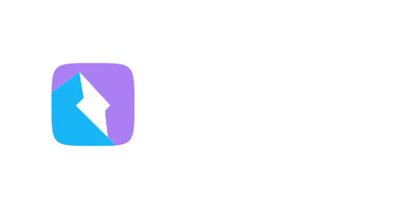

<div align="center">
  

[](https://www.npmjs.com/package/@lgr.dev/qwik-reveal)
[](https://www.npmjs.com/package/@lgr.dev/qwik-reveal)
[](https://github.com/lukeribchester/qwik.reveal/blob/main/LICENSE.md)
</div>

# Qwik Squircle ⚡️

TK.

<br>

## Browser Support

This library is supported by **96%** of browsers.

## Preview

<br>

# Get Started

## Installation

### 1. Install

Install the `@lgr.dev/qwik-squircle` dependency using your preferred package manager.

```shell
npm install @lgr.dev/qwik-squircle
```

## Usage

# Customisation
